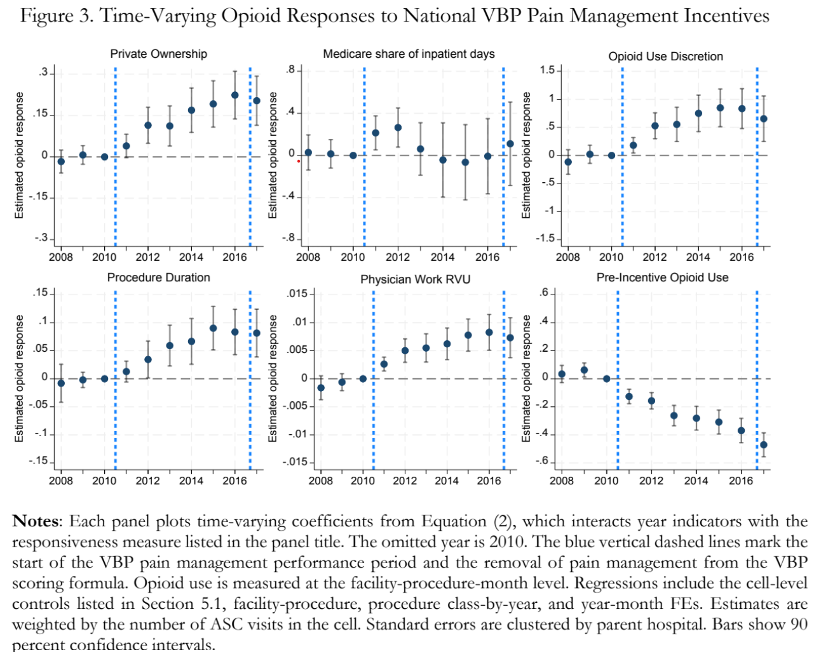

## Working Papers

1. **Addressing Pain Through Incentives: Patient Experience Rewards and Opioid Use** (with [Klara Peter](https://econ.unc.edu/people/peter-klara/) and [Qing Gong](https://sites.google.com/site/qgongecon/)) — \[[Paper](https://www.dropbox.com/scl/fi/zvn5zxpzn4b7f9mopmae3/Opioid-paper-v5.pdf?rlkey=o777822j7f3d1zi0f4ps6xhia&st=c5cen9zf&e=1&dl=0)\]
     *Revise and resubmit, American Journal of Health Economics*
   

     
Abstract

     

       

         
This paper examines how financial performance incentives affect the choice of clinical inputs when quality measures are subjective. Specifically, we study whether tying hospital reimbursement to patient-reported pain management altered opioid administration in hospital-affiliated outpatient procedural care. Under the Hospital Value-Based Purchasing (VBP) program, hospitals were rewarded based on HCAHPS pain management scores starting in 2011, before the domain was removed from the scoring formula in 2016 due to public health concerns. We link New York ambulatory surgery data from 2008-2017 to parent-hospital HCAHPS and VBP scoring measures to construct hospital-level measures of the financial returns to improving pain management scores. We find that opioid administration increased more when those returns were larger. Responses were also larger in privately owned, non-government hospitals, in procedures with greater opioid-use discretion, and in longer or more complex procedures. The use of non-opioid pain analgesics, sedatives, and non-pain medication did not rise systematically in response to the pain management incentives. Following the policy’s removal, the incentive-related opioid response did not immediately reverse. The results suggest that subjective patient experience incentives can affect clinical inputs and generate organizational spillovers.

       

       

         <!-- Upload your graph to the /images/ folder in your repo and change the file name below -->
         
       

     

   

2. **In the Shadows of Their Shields: Spillovers of Physician Substitution and Practice Liability in the Era of the non-MD Provider** — \[[Paper](https://www.dropbox.com/scl/fi/4er0lwm99w4pmyhb5d096/NYS_NP_Project-1.pdf?rlkey=wb61ykvhlav9qu14bxawewl5v&st=kvugzyxz&e=2&dl=0)\] \[[Slides coming soon](#)\] \[[Codes](#)\]
   

     
Abstract

     

       

         
I investigate how hospitals substitute labor inputs amidst physician shortages, high patient demand, and steep operating costs. Exploiting the 2015 New York State Nurse Practitioner Modernization Act (NPMA), which granted experienced Nurse Practitioners (NPs) autonomy while leaving Physician Assistants (PAs) protected under an MD’s license, I construct a novel longitudinal dataset from Medicare records (2013-2023) linking services, satisfaction and quality scores, and clinical outcomes. Despite the expansion of NP authority, overall patients seen did not increase. Furthermore, Diff-in-Diff estimates reveal NPs exhibit defensive practice in aggregate, reducing clinical effort along with MDs, while PAs seemingly absorb excess low-complexity cases and increased aggregate opioid prescribing. To run counterfactual simulations, I build a structural model incorporating a latent class framework for patient demand and a multitask principal-agent mechanism linking provider behavior to a translog hospital production function. I find Medicare patients’ utility for MDs is large, yet hospitals treat MD-heavy staffing as costly. Counterfactuals suggest the NPMA induced an excess of 40,000 PA-linked Part D opioid claims (9.13% rise) and a 0.43 percentage point increase in inpatient mortality. Ultimately, expanding non-MD scope does not simply increase access to care: results suggest mid-levels respond to liability and institutional incentives similarly to MDs, potentially triggering behaviors affecting patient welfare.

       

       

         
       

     

   

3. **Taming the Tempest: Parsimonously Nowasting the ASEAN-5** — \[[Paper coming soon]()\] \[[Slides coming soon](#)\] \[[Codes](#)\]
   

     
Abstract

     

       

         
Abstract coming soon.

       

       

         
       

     

   

## Research In Progress

1. **Patent Renewal and Creative Destruction** (with [Harun Alp](https://www.harunalp.net/)) — \[[Slides](https://www.dropbox.com/scl/fi/002d6lpjfp4x2adkt3x8d/Patents_and_Creative_Destruction-4.pdf?rlkey=kdhim0yo777xjzbn4edsukukj&st=nrxl5zov&e=1&dl=0)\] \[[Codes](#)\]
   

     
Abstract

     

       

         <ul style="margin-top: 0; padding-left: 20px;">
           <li><strong>Question:</strong> What are determinants of patent renewal when under threat of creative destruction?</li>
           <li><strong>Method:</strong> Constructing empirical measures of competition for incumbents and entrants (e.g. HHI, backward citation overlap; technology group overlap, and citation quality of rivals).</li>
           <li><strong>Data:</strong> United States Patent and Trademark Office (USPTO) claims, 1980-2025.</li>
         </ul>
       

       

         
       

     

   

2. **Explaining the Reporting Gap Reversal in US-China Trade** (with [Eva Van Leemput](https://sites.google.com/site/evavanleemput)) — \[[Slides](https://www.dropbox.com/scl/fi/ktc7gqgpomzkdpwlzmxt4/US_China_Trade_Balance__Copy_.pdf?rlkey=i1q7vilula6z9k784xcldqnb0&st=9xekaezm&e=1&dl=0)\] \[[Codes](#)\]
   

     
Abstract

     

       

         <ul style="margin-top: 0; padding-left: 20px;">
           <li><strong>Question:</strong> US-reported imports vs China-reported exports gap reverse after 2018-19 trade war. Why?</li>
           <li><strong>Method:</strong> Decomposing potential explanations (e.g. transshipping, misreporting, de minimis trade).</li>
           <li><strong>Data:</strong> HS Trade (via US Census Bureau); UN Comtrade, 2010-2025.</li>
         </ul>
       

       

         
       

     

   

3. **Sectoral Mobility Costs Across Heterogeneous Workers** (with [Gary Lyn](https://sites.google.com/site/garyanthonylyn/home)) — \[[Slides](https://www.dropbox.com/scl/fi/y85sac0d8xa3gbrs54eaz/Labor_Mobility_Costs.pdf?rlkey=o23e7yvbrolk5282f4epkknad&st=9774kx7e&e=1&dl=0)\] \[[Codes](#)\]
   

     
Abstract

     

       

         <ul style="margin-top: 0; padding-left: 20px;">
           <li><strong>Question:</strong> What are the sectoral moving costs for heterogeneous worker types?</li>
           <li><strong>Method:</strong> Estimate pooled baseline to compare against subgroups (gender, college, blue/white collar).</li>
           <li><strong>Data:</strong> ASEC/March CPS, 1977-2025.</li>
         </ul>
       

       

         
       

     

   

4. **Provision of Services Following Individual Mandate Repeal** (with [Qing Gong](https://sites.google.com/site/qgongecon/)) — \[[Prelim Graphs](https://docs.google.com/presentation/d/1eI-T6ZH8nLCWnvVQEhvEJnMBZoaxf6T797LzSXi3uq8/edit?slide=id.p#slide=id.p)\]
   

     
Abstract

     

       

         <ul style="margin-top: 0; padding-left: 20px;">
           <li><strong>Question:</strong> How did hospitals respond to uninsured pop. rise after ACA individual mandate repeal?</li>
           <li><strong>Method:</strong> Event study analysis of provider-patient level claims across different patient subgroups.</li>
           <li><strong>Data:</strong> Healthcare Cost and Utilization Project datasets (SASD/SID/SEDD), NYS (2006-2022).</li>
         </ul>
       

       

         
       

     

   

5. **Who Bears the Sacrifice? Exploring Collection Across the Income Distribution** — \[[Proposal](#)\] 
   

     
Abstract

     

       

         
In developing countries, informality allows certain low-income groups to fly under the radar and thus avoid taxes. Along with evasion from high-income groups, this potentially squeezes the middle class. Consequently, I investigate which income group bears the greatest effective burden when a developing state increases demand for income tax revenue. To do so, I construct a discrete choice model incorporating the canonical work of Allingham and Sandmo (1972) on tax evasion with an additional dynamic of state decision making, revealing a potential "cat-and-mouse" game between the state and the wealthiest class. Empirically, I deconstruct income tax revenue along the growth paths of the United States and Singapore.

       

       

         
       

     

   

   
## Policy Papers & Other Writing

1. **India and the Global Economy** (with [Patrice Robitaille](https://www.federalreserve.gov/econres/patrice-t-robitaille.htm)), April 2026 — \[[FEDS Note](https://www.federalreserve.gov/econres/notes/feds-notes/india-and-the-global-economy-20260408.html)\]
     Farrag, Omar, and Patrice Robitaille (2026). "India and the Global Economy," FEDS Notes. Washington: Board of Governors of the Federal Reserve System, April 08, 2026.

2. **Health or Satisfaction? Investigating the Link Between Patient Satisfaction Scores and Provider Prescribing Patterns** (undergraduate Honors Thesis), April 2024 — \[[UNC version](https://cdr.lib.unc.edu/concern/honors_theses/3484zt643?locale=en)\] \[[Slides](https://www.dropbox.com/scl/fi/4er0lwm99w4pmyhb5d096/NYS_NP_Project-1.pdf?rlkey=wb61ykvhlav9qu14bxawewl5v&st=kvugzyxz&e=2&dl=0)\]
   

     
Abstract

     

       

         
In 2006, the Centers of Medicare and Medicaid Services (CMS) introduced the Hospital Consumer Assessment of Healthcare Providers and Systems (HCAHPS), which were made public quarterly beginning in 2008 and are based on subjective measures of patient satisfaction. We suspect these scores create additional incentives driving inefficient prescribing patterns. Using ambulatory and out-patient facilities in the State of New York in conjunction with HCAHPS scores, we test our hypothesis that patient satisfaction scores induce inefficient prescribing behavior. We find hospital systems’ preferences for raising scores in the prescribing setting is not monotonic, with a 1-standard-deviation increase in the present year’s satisfaction score triggering a 4.16 percentage point increase in the likelihood of prescribing to a patient whom we do not expect to present a case commonly susceptible to overprescribing. Additionally, we find that the prescribing behavior of public hospitals is not as influenced by changes in their satisfaction scores as is the prescribing behavior of private hospitals. Finally, we investigate prescribing treatment towards subgroups of the patient population and find that women, racial minorities, and self-paying patients are the most vulnerable to experiencing differential treatment and inefficient prescribing patterns in response to changes in satisfaction scores.

       

       

         
       

     

   

